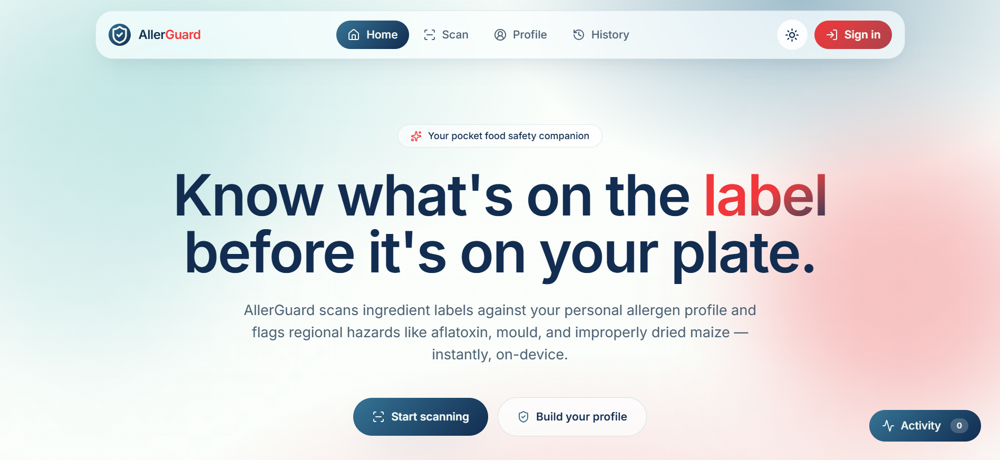

# AllerGuard

Your pocket food safety companion — scan ingredient labels against your personal allergen profile and flag regional hazards instantly, on-device.



## Features

- **Instant Label Scanning**: Use your camera to scan food product labels and extract ingredients using OCR technology
- **Personal Allergen Profiles**: Build custom allergen profiles to track what matters to you
- **Regional Hazard Detection**: Automatically flags regional hazards like aflatoxin, mould, and improperly dried maize
- **Real-time Analysis**: Get instant verdicts (SAFE, WARNING, or CRITICAL) with highlighted allergen matches
- **Scan History**: Track and review your previous scans
- **Cross-contamination Alerts**: Detects "may contain" warnings and manufacturing facility information
- **Dark/Light Mode**: Beautiful theming with OKLCH color palette
- **Privacy-First**: All processing happens on-device with k-anonymity compliance

## Tech Stack

- **Framework**: TanStack Start (React SSR framework)
- **UI**: React 19 + TypeScript
- **Styling**: TailwindCSS 4 with custom design system
- **Components**: Radix UI primitives + shadcn/ui
- **OCR**: Tesseract.js for text extraction
- **State Management**: Zustand
- **Routing**: TanStack Router
- **Forms**: React Hook Form + Zod validation
- **Animations**: Framer Motion

## Getting Started

### Prerequisites

- Node.js 18+
- Bun or npm

### Installation

```bash
# Install dependencies
bun install

# Start development server
bun dev
```

The application will be available at `http://localhost:3000`

### Build for Production

```bash
bun build
```

## Usage

1. **Build Your Profile**: Navigate to the Profile section to set up your allergen preferences
2. **Scan Labels**: Use the Scan feature to capture food product labels
3. **View Results**: Get instant analysis with highlighted allergens and hazard warnings
4. **Track History**: Review your scan history in the History section

## Project Structure

```
src/
├── components/          # React components
│   ├── ui/             # shadcn/ui components
│   └── ...             # Feature components
├── lib/                # Utility libraries
│   ├── scan-engine.ts  # Allergen detection logic
│   └── ocr.ts          # OCR service
├── routes/             # TanStack Router routes
├── store/              # Zustand state management
└── styles.css          # Global styles and design system
```

## Environment Variables

Create a `.env` file in the root directory:

```env
VITE_N8N_WEBHOOK_URL=your_webhook_url
```

## License

MIT
